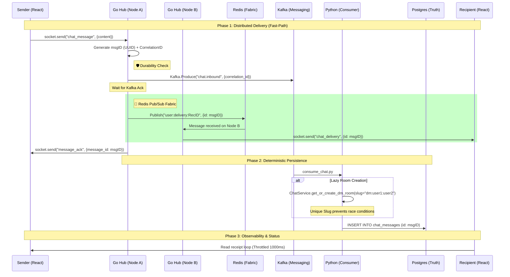

# Enterprise-Scale Chat Architecture (50M+ Concurrent)

This document details the distributed, safety-first architecture designed for massive horizontal scale and absolute data integrity.

---

## 1. System Overview

The architecture utilizes a multi-layered approach to handle high-concurrency real-time delivery with strict durability and traceability.

### Distributed Data Flow Sequence

---

## 2. Distributed Scale Foundations

### Horizontal Scale Fabric (Redis Presence Routing)
To support multiple Go Hub instances, we use Redis as a high-speed messaging fabric with **Presence-Aware Targeting**.
*   **Presence Registry**: When a user connects, the node registers the `user_id -> node_id` mapping in Redis.
*   **Targeted Publisher**: When Node A receives a message for User B, it looks up User B's current node and publishes ONLY to that node's channel (`node:delivery:{nodeID}`).
*   **Subscriber**: Each Go instance listens ONLY to its own node-specific channel.
This drastically reduces CPU and network waste by eliminating unnecessary broadcasts, allowing the system to scale to **50M+ concurrent users**.
This reduces delivery latency across nodes to **1-2ms**, compared to 50ms+ for Kafka.

### Deterministic DM Rooms (Slug Hardening)
To prevent race conditions where two users send messages simultaneously and create duplicate rooms, we use **Deterministic Slugs**. 
*   A room slug for a DM is always `dm:{min_user_id}:{max_user_id}`.
*   The database enforces a `UNIQUE` constraint on this slug.
*   Concurrent creation attempts result in a graceful fallback to the existing room.

### Observability & Traceability (Correlation IDs)
Every message flow is now tagged with a `correlation_id` from the point of entry (Go Hub) through Kafka and the Python persistence layer. This allows for:
*   **End-to-End Tracing**: Tracking a single message's journey across all microservices.
*   **Latency Monitoring**: Identifying bottlenecks in the Kafka-to-Python pipeline.

### Scalable Read Receipts (Batching)
The frontend implements a **Max-Sequence Batching** strategy, tracking the highest sequence number seen in the viewport and dispatching a single receipt at most once every 1000ms per room.
